# Laporan pertemuan ke -1 sistem operasi
**Tanggal:** 24 Februari 2026  
**Disusun Oleh:** Ariel Ardani Aris Putra  
**NIM:** 2541070200129  
**Kelas/No:** TI-1G/04

## 1. Praktikum 
2.1 — instalasi virtual box
1. download oracle virtual box:
2. install virtual box:
3. Unduh iso Ubuntu Server 22.04.4 LTS ISO downloaded dari https://ubuntu.com/download/server
4. halaman utama VirtualBox:
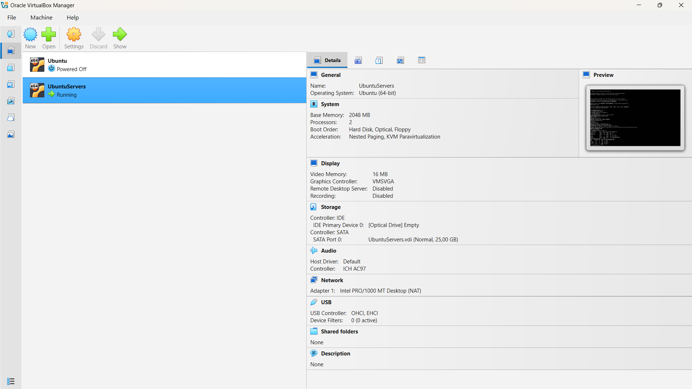
## 2. Praktikum 2.2 - Instalasi Ubuntu server di virtual box
1. Buat Virtual Machine dengan klik new pada halaman utama VirtualBox
2.  Setup VM name and Operating System

- VM Name: Nama yang Anda berikan untuk mesin virtual ini agar mudah dikenali (dalam contoh ini dinamai "Ubuntu").

- VM Folder: Lokasi penyimpanan file-file mesin virtual (seperti file konfigurasi dan hard disk virtual) di komputer fisik Anda.
   
- ISO Image: File installer sistem operasi (format .iso) yang akan digunakan untuk menginstal OS ke dalam mesin virtual.
NOTE **Masukan file iso Ubuntu Server 22.04 LTS yang sudah di download sebelumnya**

- OS Edition: Digunakan jika file ISO tersebut memiliki beberapa varian (misalnya Pro, Home, atau Enterprise) agar sistem dapat menyesuaikan konfigurasinya.

- OS: Kategori besar sistem operasi yang akan diinstal (misalnya Linux, Windows, atau macOS).

- OS Distribution: Jenis spesifik dari distribusi sistem operasi tersebut (contohnya Ubuntu, Fedora, atau Debian).

- OS Version: Versi spesifik dan arsitektur sistem operasi (dalam gambar adalah Ubuntu versi 64-bit).
3. Set up unattended guest OS installation
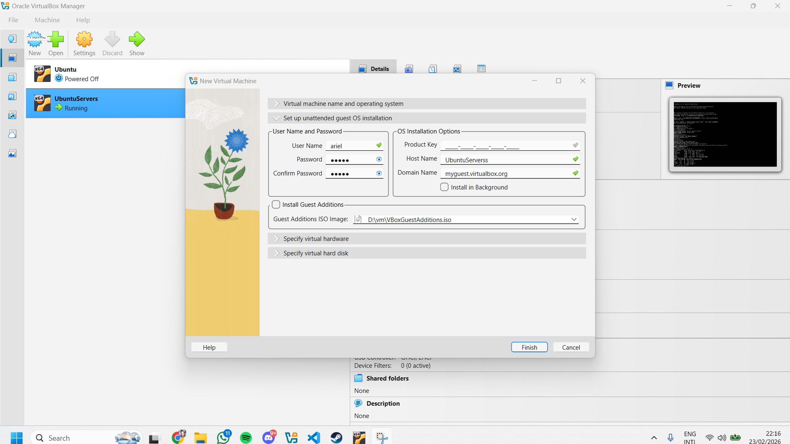
- User Name and Password: Membuat akun pengguna utama (Username: "ariel") dan kata sandinya agar Anda bisa langsung masuk setelah instalasi selesai.

- Product Key: Digunakan untuk memasukkan kode aktivasi jika Anda menginstal sistem berbayar seperti Windows.

- Host Name: Nama komputer di dalam jaringan (contoh: "UbuntuServerss").

- Domain Name: Nama domain jaringan lokal (biasanya dibiarkan standar).

- Install in Background: Jika dicentang, proses instalasi akan berjalan di latar belakang tanpa memunculkan jendela konsol.

- Install Guest Additions: Jika dicentang, VirtualBox akan langsung memasang driver khusus agar resolusi layar lebih fleksibel dan fitur copy-paste antara komputer asli dan VM bisa berjalan.
4.Specify virtual hardware
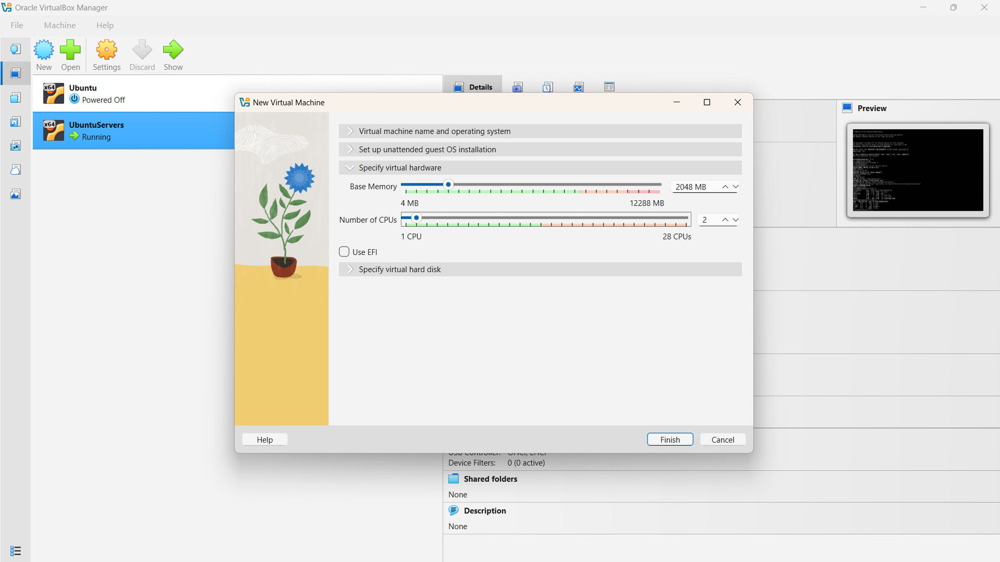
- Base Memory: Jumlah RAM yang dialokasikan untuk mesin virtual. Dalam gambar, Anda mengatur 2048 MB (2 GB). Ini adalah jumlah standar yang cukup untuk menjalankan Ubuntu Server dengan lancar.

- Number of CPUs: Jumlah inti prosesor (CPU cores) yang diberikan kepada mesin virtual. Anda memilih 2 CPU. Memberikan lebih dari 1 core sangat disarankan agar performa sistem tidak terasa lambat atau lagging.

- Use EFI (Extensible Firmware Interface): Jika dicentang, mesin virtual akan menggunakan sistem booting modern (EFI) alih-alih BIOS tradisional. Biasanya diperlukan untuk OS terbaru atau jika Anda ingin mencoba fitur keamanan tertentu.
5. Specify virtual hard disk
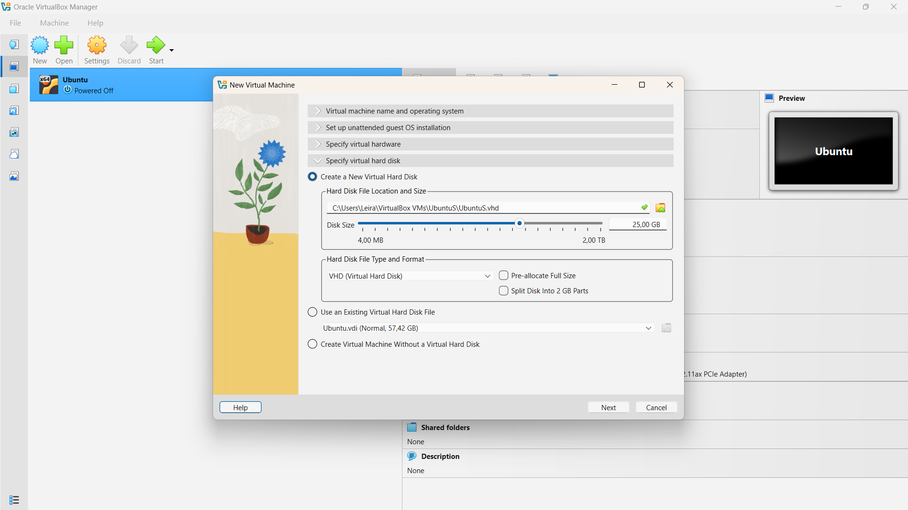
- Disk Size: Kapasitas total hard disk virtual (setting: 25 GB).

- **VHD (Virtual Hard Disk): Format file penyimpanan yang Anda pilih (kompatibel dengan Microsoft Virtual PC).**

- Pre-allocate Full Size: Jika dicentang, VirtualBox akan langsung mengambil 25 GB dari hard disk asli Anda. Jika tidak, file akan membesar secara bertahap sesuai isi di dalamnya.

- Use an Existing Virtual Hard Disk File: Pilihan jika Anda ingin menggunakan file hard disk yang sudah ada sebelumnya daripada membuat yang baru.

6. setelah mengklik finish maka virtual machine telah terinstall, dan pada kasus saya virtual machine tersebut auto run sehingga instalasi ubuntu akan langsung dimulai.

## 2. latihan 
2.1 latihan konseptual
1.1 jelaskan 5 fungsi utama sistem operasi dengan contoh konkret dari minimal 2 OS berbeda (Windows, macOS, atau Linux).
jawab : 
1. Manajemen Proses
Mengatur jalannya aplikasi dan penggunaan CPU.

Windows: Menghentikan program macet lewat Task Manager.

Linux: Memantau proses sistem via Terminal dengan perintah top.

2. Manajemen Memori
Mengalokasikan ruang RAM untuk tiap program agar tidak bentrok.

Windows: Mengosongkan RAM dari aplikasi lama untuk aplikasi baru.

Linux: Menggunakan Swap (area disk) sebagai RAM cadangan saat penuh.

3. Manajemen Penyimpanan
Mengatur struktur folder dan cara data disimpan di disk.

Windows: Menggunakan sistem file NTFS untuk mengelola data di Drive C:.

Linux: Menggunakan sistem file EXT4 yang efisien dalam menyimpan data server.

4. Manajemen Perangkat (I/O)
Menghubungkan hardware (printer, mouse, GPU) dengan sistem melalui driver.

Windows: Otomatis mendeteksi dan mengunduh driver kartu grafis.

Linux: Sebagian besar driver printer sudah tersedia langsung di dalam Kernel.

5. Manajemen Keamanan
Melindungi sistem dari akses ilegal dan mengatur hak pengguna.

Windows: Konfirmasi izin admin lewat jendela User Account Control (UAC).

Linux: Keamanan ketat melalui perintah sudo untuk perubahan sistem.

1.2 Kapan sebaiknya menggunakan Windows vs Linux vs macOS? Analisis berdasarkan use case: gaming, development, server, creative work, dan enter-prise.
jawab : 
### Analisis Pemilihan OS Berdasarkan Use Case

| Use Case | OS Utama | Alasan Utama |
| :--- | :--- | :--- |
| **Gaming** | Windows | Kompatibilitas game yang luas & dukungan Driver GPU terbaru. |
| **Development** | Linux / macOS | Lingkungan berbasis Unix yang stabil & ramah bagi programmer. |
| **Server** | Linux | Efisiensi tinggi, keamanan lebih terjaga, & bersifat open-source. |
| **Creative** | macOS | Ekosistem software kreatif yang matang & akurasi warna layar. |
| **Enterprise** | Windows | Dominasi aplikasi Office & kemudahan IT Management (Active Directory). |

## 2.2 Latihan Praktikal
2.1 Install Ubuntu Server 24.04.3 di VirtualBox dengan langkah berikut:
1. Download Ubuntu Server ISO dari website resmi
2. Create VM baru di VirtualBox (RAM: 2GB, Disk: 25GB)
3. Install dengan automatic partitioning (guided)
4. Buat user account dengan password yang kuat
5. Reboot dan login ke sistem
6. Dokumentasikan proses instalasi dengan screenshot key steps

jawab : ada di awal laporan

2.2 Setelah instalasi Ubuntu Server, lakukan tasks berikut:
1. Update package list: sudo apt update
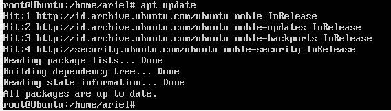

2. Upgrade packages: sudo apt upgrade
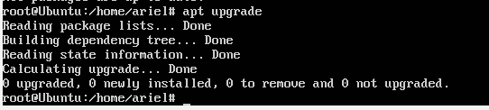

3. Install neofetch: sudo apt install neofetch
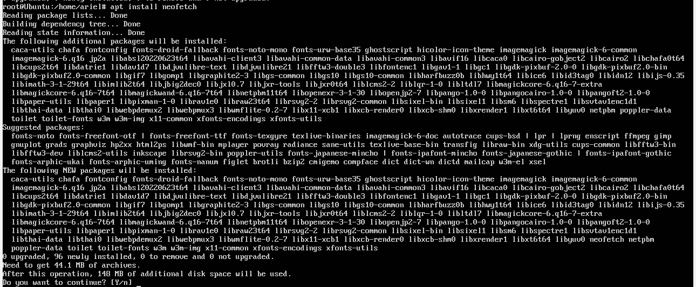

4. Jalankan neofetch dan screenshot hasilnya
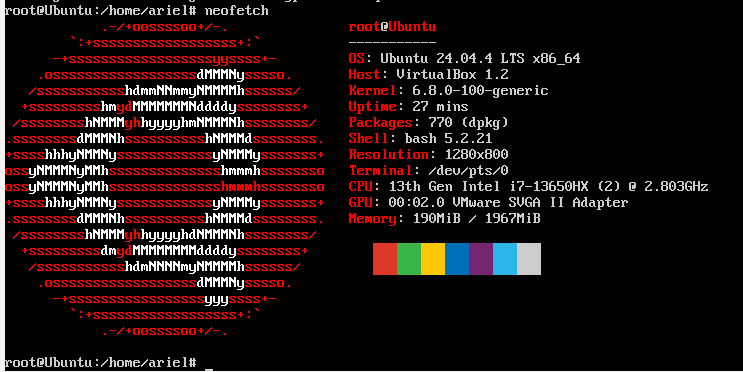

5. Check disk usage dengan df -h
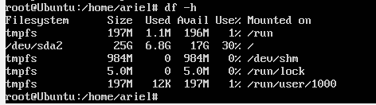

6. Check memory dengan free -h
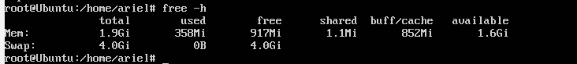

7. Dokumentasikan output dari setiap command
jawab : sudah

2.3 Eksplorasi sistem yang baru diinstall:
1. Tampilkan informasi OS: cat /etc/os-release
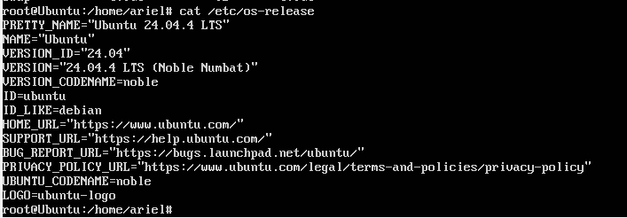
berdasarkan informasi yang saya lakukan informasi os saya memakai ubuntu versi 24.04

2. Tampilkan versi kernel: uname -r
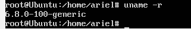
berdasarkan informasi yang saya lakukan kernel saya 6.8.0-100-generic

3. List partisi: lsblk
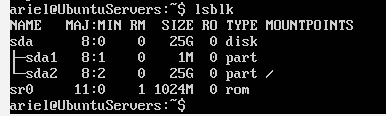  

4. Check network connectivity: ping -c 4 google.com
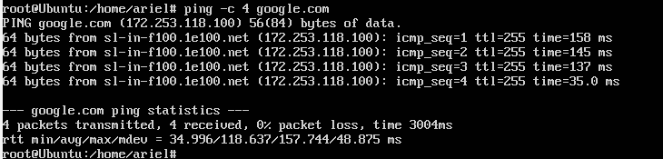
berdasarkan pengecekan /ping ke google tercatat berhasil tidak rto

5. Install dan jalankan htop untuk melihat resource usage   
- install
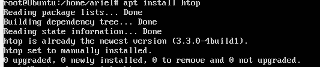
- run
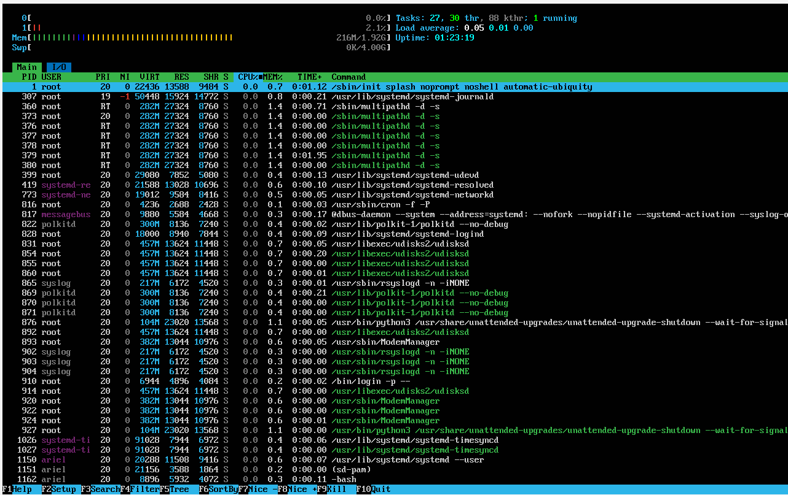
saya sudah menginstall sebelumnya jadi di foto yang saya lampirkan itu hasilnya resource usagenya

6. Buat laporan singkat tentang konfigurasi sistem Anda
jawab : sudah

## 2.3 Latihan Refleksi
Ceritakan pengalaman Anda dengan sistem operasi:
1. Sistem operasi apa yang Anda gunakan sehari-hari? (Windows, macOS,
Linux, atau lainnya)
jawab : 
Windows.

2. Berapa lama Anda menggunakan sistem operasi tersebut?
jawab :
Sejak awal kuliah.

3. Apa yang Anda sukai dari sistem operasi tersebut?
jawab :
GUI yang mudah dipahami. dan yang paling utama adalah bisa main VALORANT.

4. Apa tantangan atau masalah yang pernah Anda hadapi?
jawab :
blue screen.

5. Apakah Anda pernah menggunakan sistem operasi lain? Bandingkan pengalaman Anda.
jawab :
saya pernah secara virtual menggunakan Debian Server pada saat smk dan saya tidak terlalu memahaminya. saya lebih menyukai windows karena bisa dengan mudah main **Valorant**

6. Setelah mempelajari bab ini, apakah ada sistem operasi lain yang ingin Anda coba? Mengapa?
jawab :
Untuk saat ini saya belum tertarik menggunakan OS lain selain Windows dan Ubuntu. karena saya masih sangat pemula dalam perOS an.

- Tulis refleksi Anda dalam 300-500 kata disertai dengan dokumentasi.
jawab : Pengalaman saya dengan sistem operasi merupakan perjalanan yang memadukan kebutuhan personal dengan tuntutan profesional di industri teknologi informasi. Sejak masa sekolah, Windows telah menjadi sistem operasi utama yang saya gunakan sehari-hari. Kemudahan instalasi aplikasi, antarmuka grafis (GUI) yang mudah dipahami, serta dukungan luas untuk hobi seperti bermain Valorant, menjadikannya pilihan praktis untuk produktivitas harian. Namun, Windows bukannya tanpa masalah; tantangan seperti blue screen terkadang menjadi kendala yang menghambat aktivitas saya.
Seiring berjalannya waktu, pandangan saya terhadap sistem operasi mulai bergeser dari sekadar antarmuka grafis menjadi sebuah alat infrastruktur yang kritikal. Titik balik terbesar adalah ketika saya mulai bersentuhan dengan dunia jaringan sebagai NOC (Network Operations Center). Di lingkungan ini, keandalan adalah segalanya. Saya mulai intensif menggunakan Ubuntu dan Proxmox VE (hypervisor berbasis Debian) untuk mengelola sumber daya server dengan efisiensi tinggi.
Membandingkan Windows dengan ekosistem Linux/Proxmox memberikan perspektif yang menarik. Windows memang unggul dalam hal User Interface, namun ia sering menghadapi kendala efisiensi seperti proses update yang memakan waktu. Sebaliknya, Ubuntu menawarkan stabilitas luar biasa melalui Command Line Interface (CLI). Melalui terminal, saya merasa memiliki kendali penuh atas sistem tanpa beban overhead dari antarmuka grafis yang berat.
Dalam praktikum kali ini, saya mempelajari perintah-perintah vital seperti lsblk untuk melihat partisi, htop untuk memantau beban CPU, serta pengecekan konektivitas melalui ping. Perintah-perintah ini bukan sekadar baris kode, melainkan instrumen vital bagi seorang pengelola jaringan untuk memastikan layanan tetap prima. Meskipun saya pernah menggunakan Debian Server saat SMK dan merasa kurang memahaminya, praktikum instalasi Ubuntu Server 24.04 di VirtualBox ini membantu saya kembali ke dasar-dasar yang penting, mulai dari alokasi RAM 2GB hingga pengaturan disk 25GB.
Ke depannya, saya tertantang untuk membawa kemampuan saya ke level yang lebih spesifik, seperti melakukan eksperimen dengan MikroTik RouterOS di dalam lingkungan virtual Proxmox. Fokus saya adalah memperdalam optimasi traffic jaringan dan penguatan keamanan sistem. Bagi saya, sistem operasi bukan lagi sekadar platform untuk menjalankan aplikasi, melainkan sebuah ekosistem yang harus dioptimalkan untuk mendukung konektivitas global.

dokumentasi : 
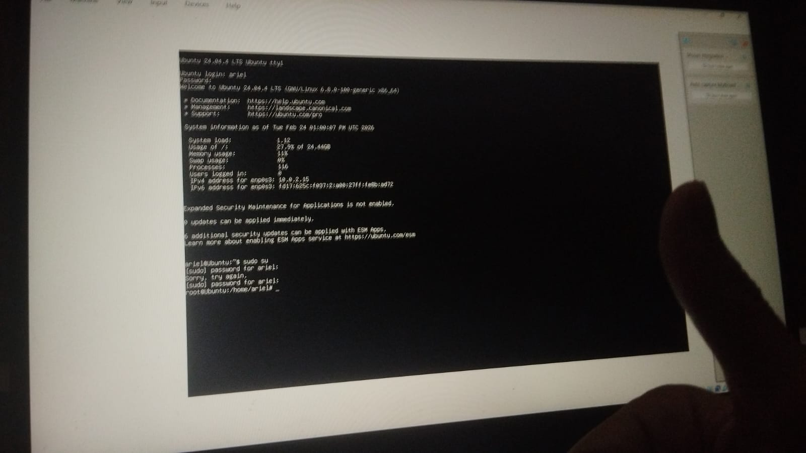