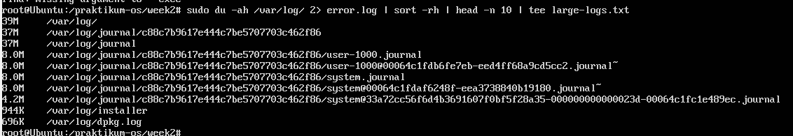
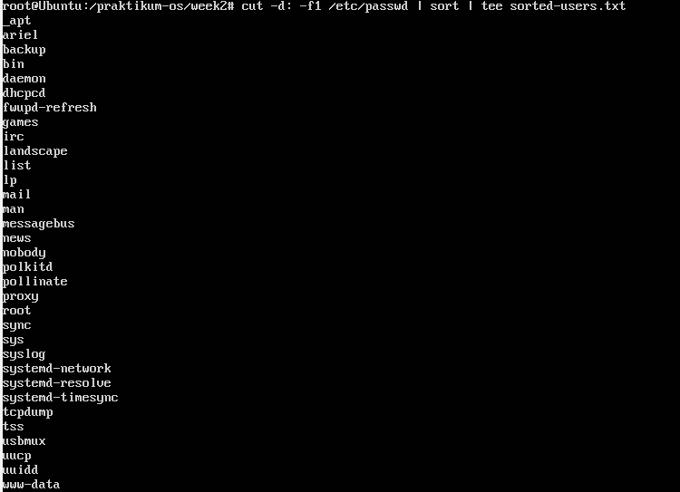
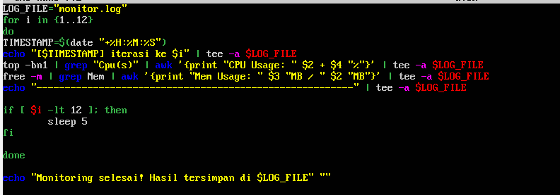
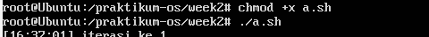
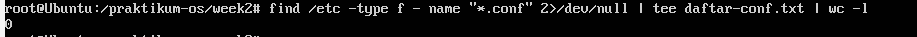
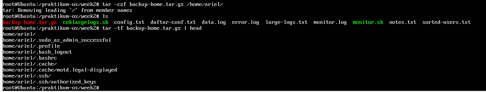

# Laporan pertemuan 3 sistem operasi

<h4>Nama : Ariel Ardani Aris Putra<h4>
<h4>NIM  : 254107020129<h4>
<h4>Kelas : TI-1G<h4>

## 1.11 Latihan

### Latihan 3.1
### pertanyaan
Buatlah script yang:
1. Menampilkan daftar 10 file terbesar di direktori /var/log/
2. Menyimpan hasilnya ke file large-logs.txt
3. Menampilkan output juga di terminal menggunakan tee
4. Menangani error dengan redirect ke error.log

### jawaban

### Latihan 3.2
### pertanyaan
Buat pipeline yang:
1. Membaca /etc/passwd
2. Mengekstrak username (kolom pertama)
3. Mengurutkan alfabetis
4. Menyimpan ke file sorted-users.txt
Hint: Gunakan cut, sort, dan operator redirect.

### jawaban

### Latihan 3.3
### pertanyaan
Tulis script monitoring yang:
1. Mencatat penggunaan CPU dan memory setiap 5 detik
2. Menyimpan log dengan timestamp
3. Berjalan selama 1 menit (12 iterasi)
4. Output ditampilkan di terminal DAN disimpan ke file

### jawaban
1. buat dan buka file monitor (contoh a.sh)

2. Ubah isi file menjadi seperti gambar

### Deskripsi Program
Script `a.sh` adalah program berbasis Bash yang berfungsi untuk memantau performa perangkat keras secara otomatis dan menyimpannya ke dalam file log.

### Komponen Utama
* **Variabel LOG_FILE**: Menentukan `monitor.log` sebagai tempat penyimpanan data.
* **Looping (for)**: Menjalankan pemantauan sebanyak 12 kali iterasi.
* **Timestamp**: Mencatat waktu pengambilan data menggunakan perintah `date`.
* **Monitoring CPU**: Mengambil data penggunaan CPU (user + system) dari perintah `top`.
* **Monitoring Memori**: Mengambil data RAM yang terpakai dan total kapasitas dari perintah `free`.
* **Logika Jeda**: Memberikan interval waktu 5 detik antar iterasi menggunakan `sleep`.

### Alur Kerja
a. Program memulai perulangan dari 1 hingga 12.

b. Di setiap putaran, program mengambil data statistik CPU dan Memori.

c. Hasilnya ditampilkan ke terminal dan dicatat ke file log secara bersamaan menggunakan perintah `tee -a`.

d. Program berhenti secara otomatis setelah iterasi ke-12 selesai.

 3. Hasil eksekusi

### Latihan 3.4
### pertanyaan
Buat perintah yang:
1. Mencari semua file .conf di sistem
2. Membuang pesan "Permission denied"
3. Menghitung jumlah file yang ditemukan
4. Menyimpan daftar path lengkap ke file

### jawaban

File yang di temukan adalah 0

### Latihan 3.5
### pertanyaan
Implementasikan script backup yang:
1. Menggunakan tar untuk backup direktori
2. Menampilkan progress dengan tee
3. Mencatat stdout ke backup-success.log
4. Mencatat stderr ke backup-error.log
5. Menambahkan timestamp di setiap log entry

### jawaban
