# Laporan pertemuan ke -4 sistem operasi
**Tanggal:** 04 Maret 2026  
**Disusun Oleh:** Ariel Ardani Aris Putra  
**NIM:** 2541070200129  
**Kelas/No:** TI-1G/04

## TUGAS PENDAHULUAN:
    Jawablah pertanyaan-pertanyaan di bawah ini :
1. Apa yang dimaksud perintah-perintah direktory : pwd, cd, mkdir, rmdir.
2. Apa yang dimaksud perintah-perintah manipulasi file :	cp, mv dan rm (sertakan format yang digunakan)
3. Jelaskan perbedaan Symbolic link menggunakan hard link (direct) dan soft link (indirect).
4. Tuliskan maksud perintah-perintah : file, find, which, locate dan grep.

Jawab:  
1.  -  pwd (Print Working Directory)  
    Perintah untuk menampilkan direktori aktif saat ini (posisi kita sedang berada di folder mana).  
    -  cd (Change Directory)  
    Perintah untuk berpindah direktori.   
    -  mkdir (Make Directory)      
    Perintah untuk membuat direktori baru.  
    -  rmdir (Remove Directory)  
    Perintah untuk menghapus direktori kosong.

2.  - cp (Copy)  
    Perintah untuk menyalin file atau direktori.
    - mv (Move)
    Perintah untuk memindahkan atau mengganti nama file/direktori.
    - rm (Remove)
    Perintah untuk menghapus file atau direktori
3. Perbedaan
> Hard Link (Direct Link)
- Merupakan salinan referensi langsung ke inode file asli.
- Jika file asli dihapus, hard link tetap bisa mengakses data.
- Tidak bisa digunakan untuk folder.
- Tidak bisa lintas partisi.
> Soft Link (Symbolic Link / Indirect Link)

- Merupakan shortcut yang menunjuk ke file asli.
- Jika file asli dihapus, soft link akan rusak (broken link).
- Bisa digunakan untuk folder.
- Bisa lintas partisi.
4.  - file Digunakan untuk mengetahui tipe atau jenis suatu file.
    - find Digunakan untuk mencari file atau direktori berdasarkan kriteria tertentu.
    - which Digunakan untuk mengetahui lokasi file executable dari suatu perintah.
    - locate Digunakan untuk mencari file dengan cepat berdasarkan database sistem.
    - grep Digunakan untuk mencari teks tertentu di dalam file.
## Percobaan
### Percobaan 1 Direktory
- Melihat direktory home  
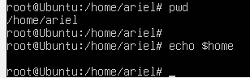
- Melihat direktori aktual dan parent direktori  
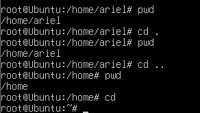
- Membuat satu direktori, lebih dari satu direktori atau sub direktori  
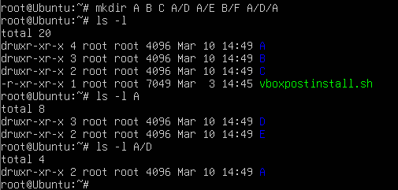
- Menghapus satu atau lebih direktori
Menghapus satu atau lebih direktori hanya dapat dilakukan pada direktori kosong dan hanya dapat dihapus oleh pemiliknya kecuali bila diberikan ijin aksesnya.
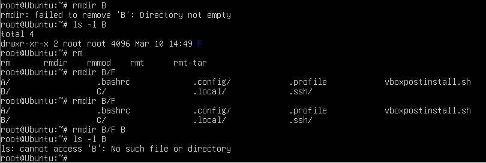
1. terdapat pesan error "rmdir: failed to remove 'B': Directory not empty"  
Perintah rmdir B gagal karena direktori B tidak kosong. rmdir hanya bisa menghapus direktori yang kosong.
2. terdapat pesan error "ls: cannot access 'B': No such file or directory"  
Direktori B sudah tidak ada lagi di sistem karena sudah di hapus dengan perintah "rmdir B/F B"

- Navigasi direktori dengan instruksi cd
Instruksi cd digunakan untuk pindah dari satu direktori ke direktori lain  
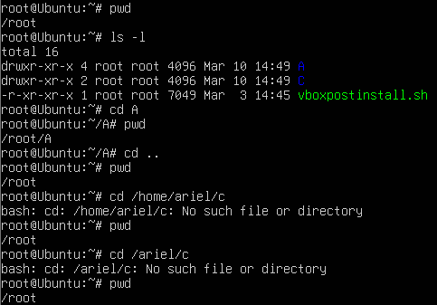

    terdapat pesan error "no such file or directory" hal tersebut dikarenakan file yang di tujukan sebagai change tidak ada

### Percobaan 2 : Manipulasi file
- Perintah cp untuk mengkopi file atau seluruh direktori  
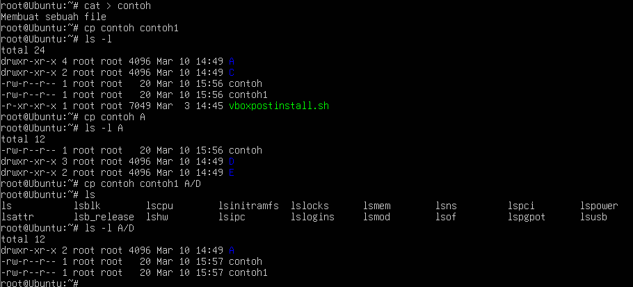
- Perintah mv untuk memindah file  
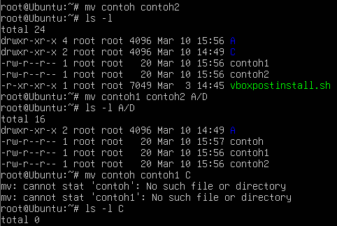
- Perintah rm untuk menghapus file   
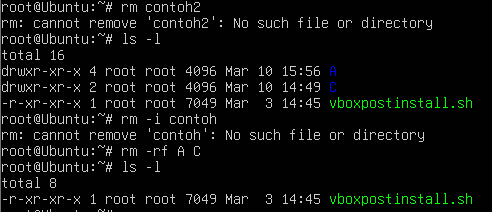

### Percobaan 3 : Symbolic Link
- Membuat Shortcut (file link)
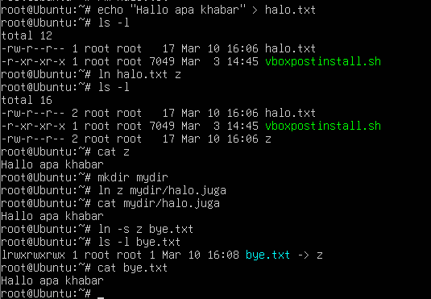
### Percobaan 4 : Melihat Isi File
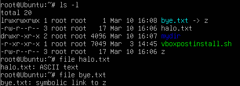
### Percobaan 5 : Mencari file
- Perintah find  
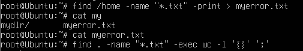
- Perintah which  
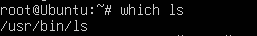
- Perintah locate  
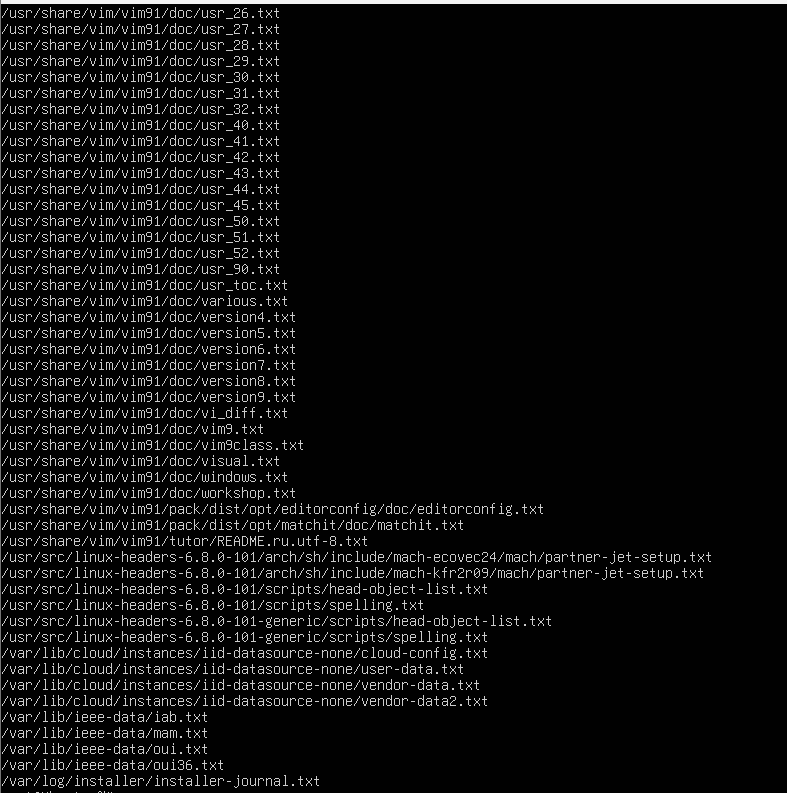
### Percobaan 6 : Mencari text pada file
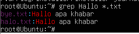
## LATIHAN:
1. Coba urutan perintah berikut :
- cd  
- pwd  
- ls –al  
- cd .
- pwd
- cd ..
- pwd
- ls -al
- cd ..
- pwd
- ls -al
- cd /etc
- ls –al | more
- cat passwd
- cd –
- pwd  
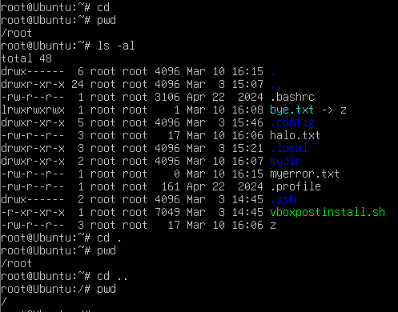  
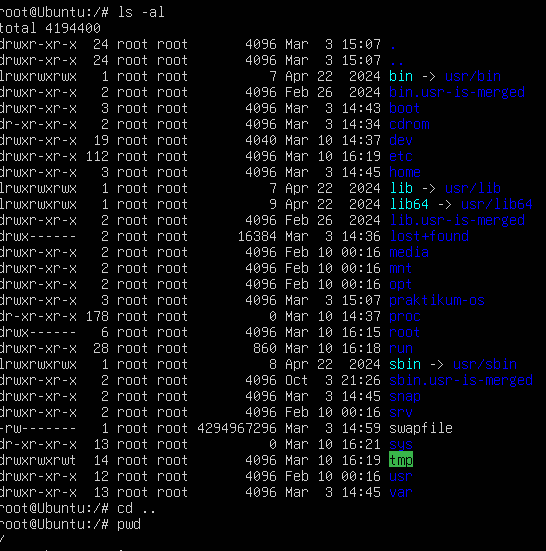

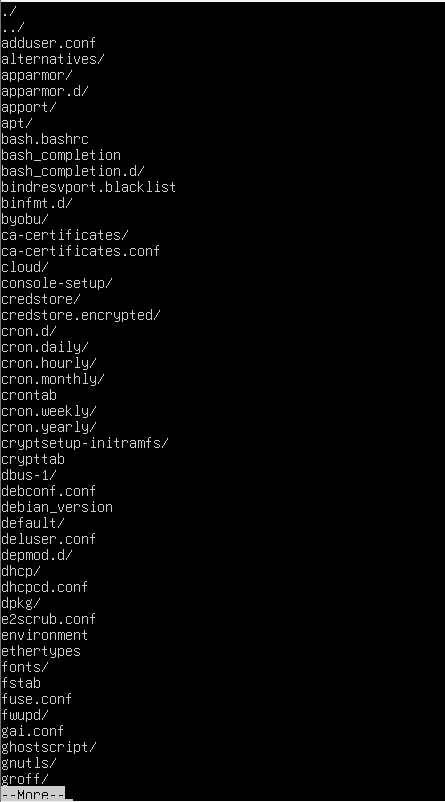
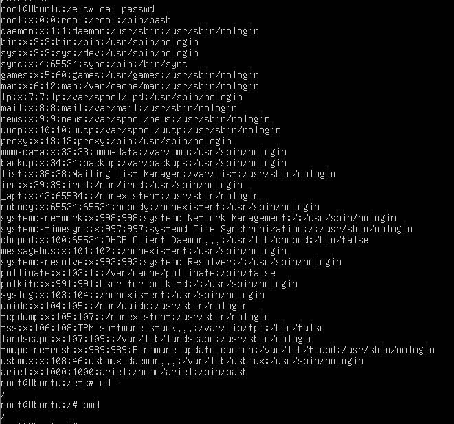

2. Lanjutkan penelusuran pohon pada sistem file menggunakan cd, ls, pwd dan cat. Telusuri direktory /bin, /usr/bin, /sbin, /tmp dan /boot.  
- /bin  
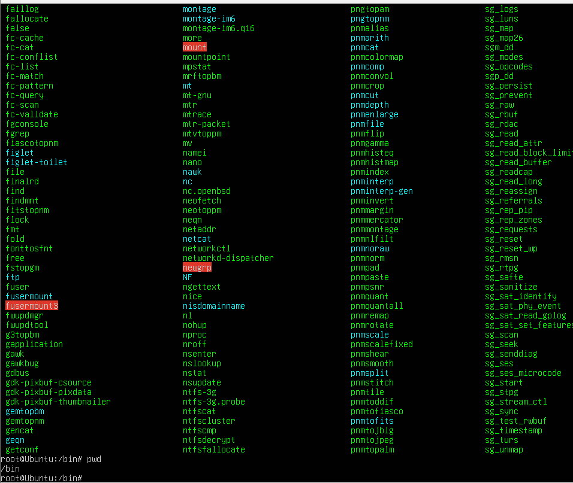
- /usr/bin  
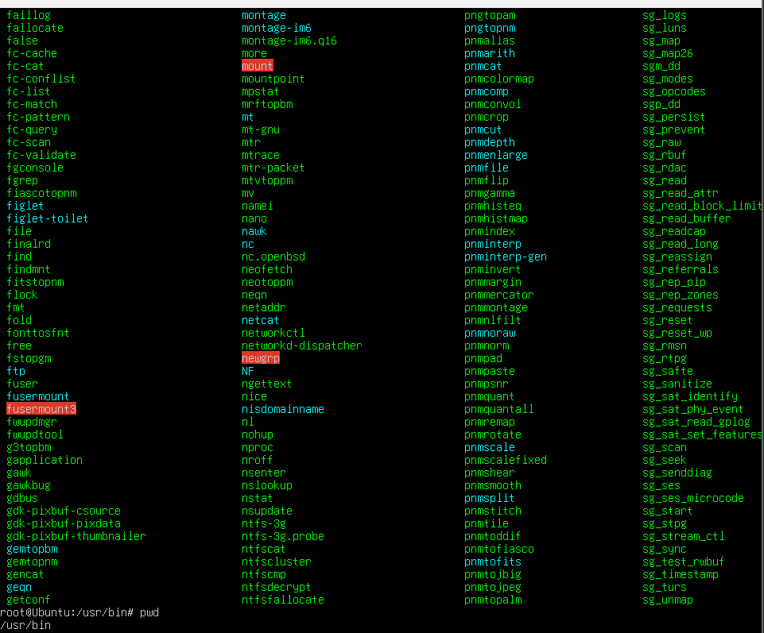
- /sbin  
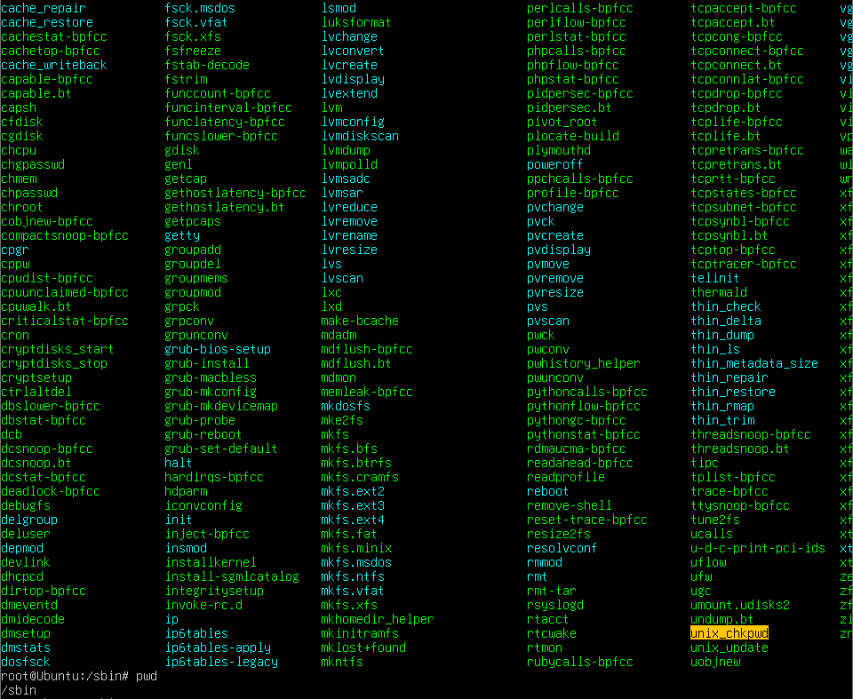
- /tmp  
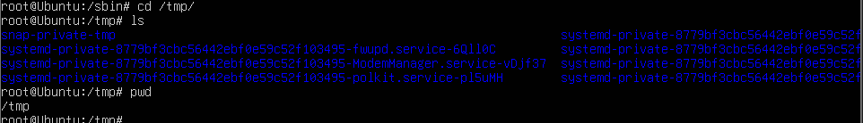
- /boot  
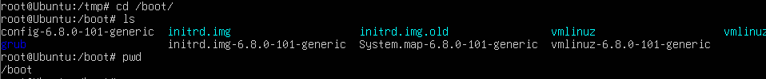
3. Telusuri direktory /dev. Identifikasi perangkat yang tersedia. Identifikasi tty (termninal) Anda (ketik who am i); siapa pemilih tty Anda (gunakan ls –l).  
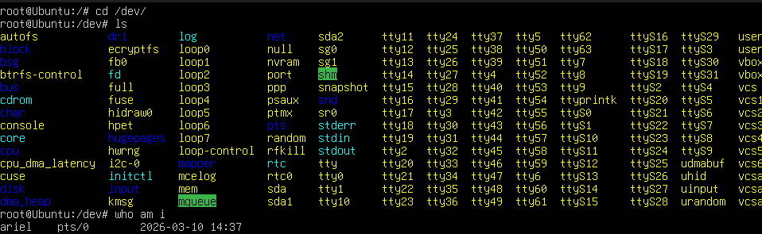
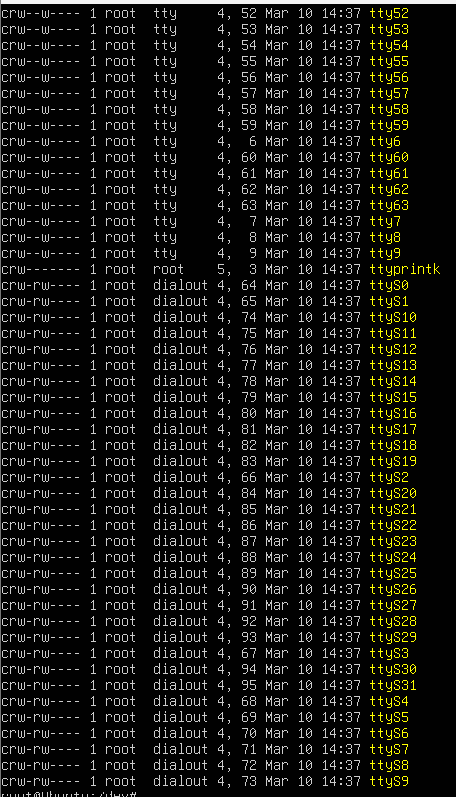
4. Telusuri derectory /proc. Tampilkan isi file interrupts, devices, cpuinfo, meminfo dan uptime menggunakan perintah cat. Dapatkah Anda melihat mengapa directory /proc disebut pseudo -filesystem yang memungkinkan akses ke struktur data kernel ? 
- cat interrupts   
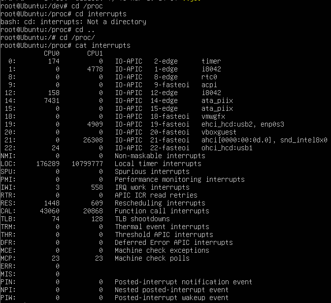
- cat devices    
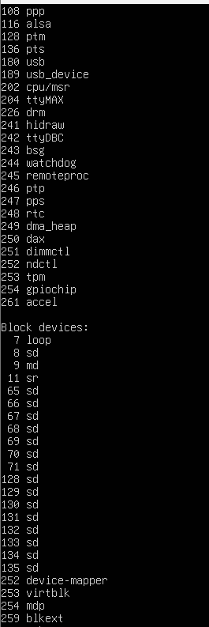
- cat cpuinfo  
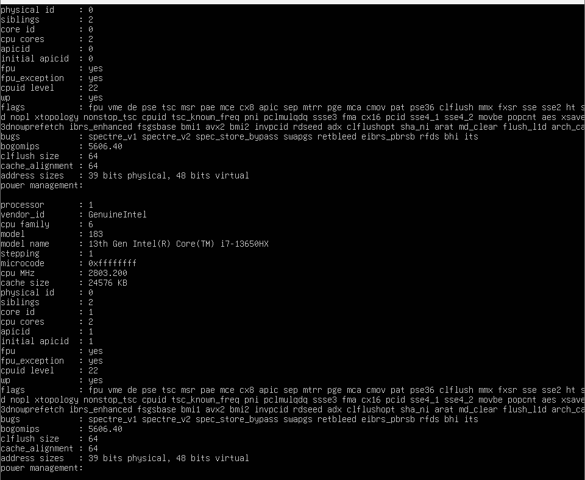
- cat meminfo  
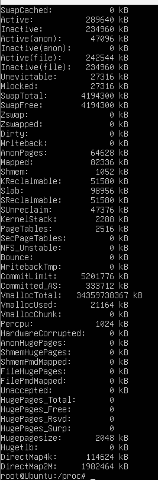
- cat uptime  
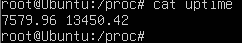
5. Ubahlah direktory home ke user lain secara langsung menggunakan cd ~username.  

6. Ubah kembali ke direktory home Anda.  

7. Buat subdirektory work dan play.  

8. Hapus subdirektory work.  

9. Copy file /etc/passwd ke direktory home Anda.  

10. Pindahkan ke subirectory play.  

11. Ubahlah ke subdirektory play dan buat symbolic link dengan nama terminal yang menunjuk ke perangkat tty. Apa yang terjadi jika melakukan hard link ke perangkat tty ?  

12. Buatlah file bernama hello.txt yang berisi kata ”hello word”. Dapatkah Anda gunakan ”cp” menggunakan ”terminal” sebagai file asal untuk menghasilkan efek yang sama ?  

13. Copy hello.txt ke terminal. Apa yang terjadi ?  

14. Masih direktory home, copy keseluruhan direktory play ke direktory bernama work menggunakan symbolic link.  

15. Hapus direktory work dan isinya dengan satu perintah.  

## LAPORAN RESMI:

1. Analisa hasil percobaan yang Anda lakukan.'

    a. Analisa setiap hasil tampilannya.  
    b. Pada Percobaan 1 point 3 buatlah pohon dari struktur file dan direktori.  
    c. Bila terdapat pesan error, jelaskan penyebabnya.

2. Kerjakan latihan diatas dan analisa hasil tampilannya.
3. Berikan kesimpulan dari praktikum ini.
