# Laporan pertemuan ke -4 sistem operasi
**Tanggal:** 04 Maret 2026  
**Disusun Oleh:** Ariel Ardani Aris Putra  
**NIM:** 2541070200129  
**Kelas/No:** TI-1G/04

## Latihan 6.1
Jalankan ps aux dan amati outputnya:
1. Berapa total proses yang berjalan? Proses apa yang memiliki PID
terkecil?  
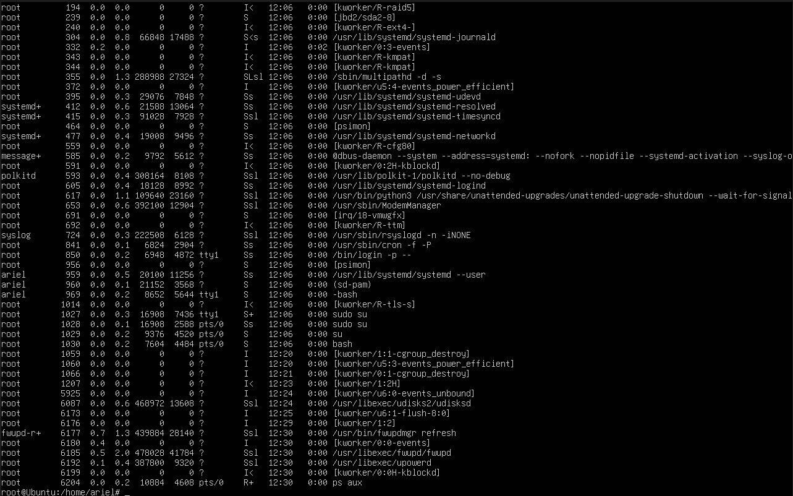 
Karena outputnya terlalu banyak jadi saya simpan outputnya pada file dengan perintah tee untuk memasukan hasil output ke suatu file
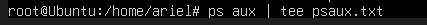 
lalu buka file nya dan scroll ke line paling bawah, lalu tekan ctrl+c sehingga bisa tampil lokasi line pada folder.
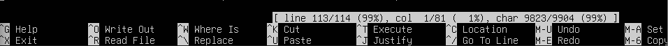 
maka terlihat proses yang sedang berjalan pada file saya ada 113 line. untuk melihat jumlah pid paling sedikit bisa dilihat di proses paling atas
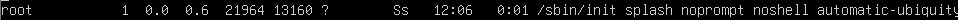 
2. Jalankan pstree -p dan temukan proses bash Anda. Proses apa yang
menjadi induk (PPID) dari bash tersebut?
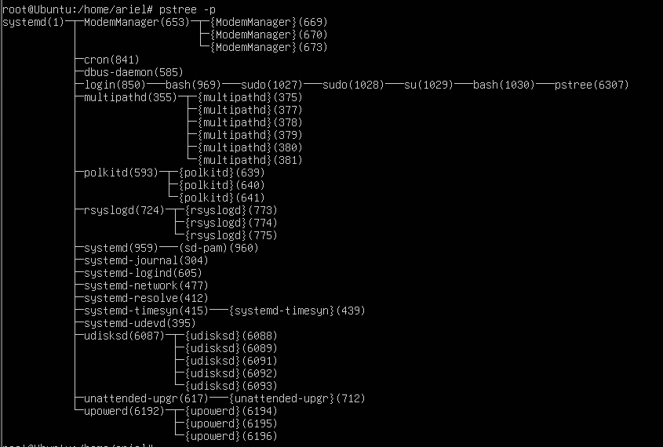 
Induk (PPID) dari bash Anda adalah proses su dengan PID 1029.
3. Bandingkan output ps aux dan ps aux -L. Apa perbedaan yang Anda lihat?
- ps aux: Digunakan untuk melihat Daftar Proses. Outputnya lebih ringkas karena satu baris hanya mewakili satu program yang sedang berjalan. Fokusnya adalah melihat aplikasi apa saja yang sedang aktif.
- ps aux -L: Digunakan untuk melihat Daftar Thread. Outputnya jadi jauh lebih panjang karena perintah ini membongkar isi di dalam proses. Satu proses yang sama bisa muncul berkali-kali di banyak baris kalau proses tersebut punya banyak thread (anak proses yang bekerja barengan).
## Latihan 6.2
1. Jalankan sleep 120 & dan amati kolom STAT pada ps aux. Kondisi apa yang ditampilkan? Mengapa proses sleep berada di kondisi tersebut?
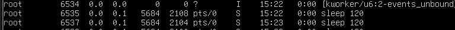 
kolom STAT untuk proses sleep 120 (dengan PID 6535 dan 6537 pada gambar) menunjukkan status S. Status S merupakan singkatan dari Interruptible Sleep (Tidur yang bisa disela).
2. Jalankan beberapa perintah yang berhasil dan yang gagal, lalu catat exit code masing-masing. Pola apa yang Anda temukan?
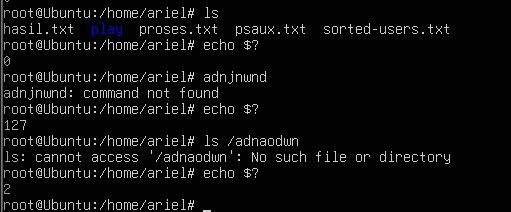 
angka 0 menunjukan program sukses dan angka selain 0 menunjukan gagal
## Latihan 6.3
1. Jalankan nice -n 5 sleep 200 & dan verifikasi nilai NI-nya dengan ps.
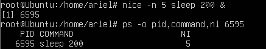 
2. Ubah nilai nice menjadi 10 menggunakan renice, lalu verifikasi kembali.
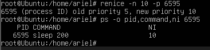 
3. Coba ubah nilai nice menjadi -5 tanpa sudo. Apa yang terjadi? Mengapa Linux membatasi hal ini untuk user biasa?
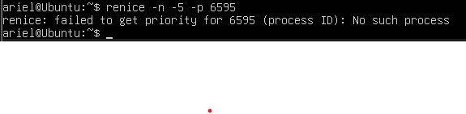 
Linux membatasi pengaturan nice negatif bagi user biasa untuk memastikan tidak ada satu user pun yang bisa memonopoli CPU secara sepihak, sehingga sistem tetap stabil dan proses-proses penting milik sistem tidak terganggu
## Latihan 6.4
1. Jalankan sleep 400 &, kirim SIGSTOP, dan amati perubahan kolom STAT. Kondisi apa yang muncul?
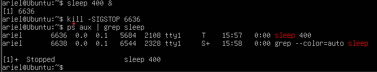 
Kolom STAT akan berubah menjadi T
2. Kirim SIGCONT dan verifikasi proses kembali berjalan.
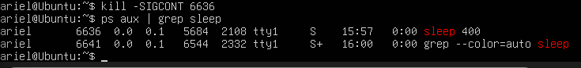 
3. Hentikan proses dengan SIGTERM lalu verifikasi sudah tidak ada. Kapan Anda memilih SIGKILL daripada SIGTERM?
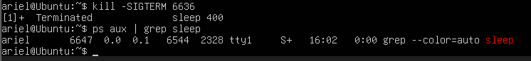 
Jika di ibarakan pada windows 
- SIGTERM itu ibarat melakukan close aplikasi
- SIGKILL itu ibarat melakukan end task pada task manajer
- Kesimpulan nya pilih SIGTERM apabila program berjalan lancar dan pilih SIGKILL bila terjadi freeze atau program tidak berjalan lancar
## Latihan 6.5
1. Jalankan top di foreground. Apa yang terjadi di terminal?
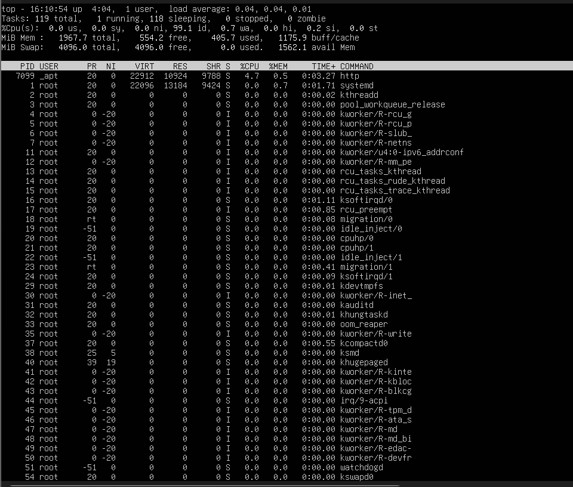 
2. Tekan Ctrl+Z dan cek statusnya dengan jobs. Kondisi apa yang ditampilkan?
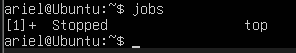 
3. Pindahkan ke background dengan bg. Apakah top dapat berjalan dengan baik di background? Mengapa?
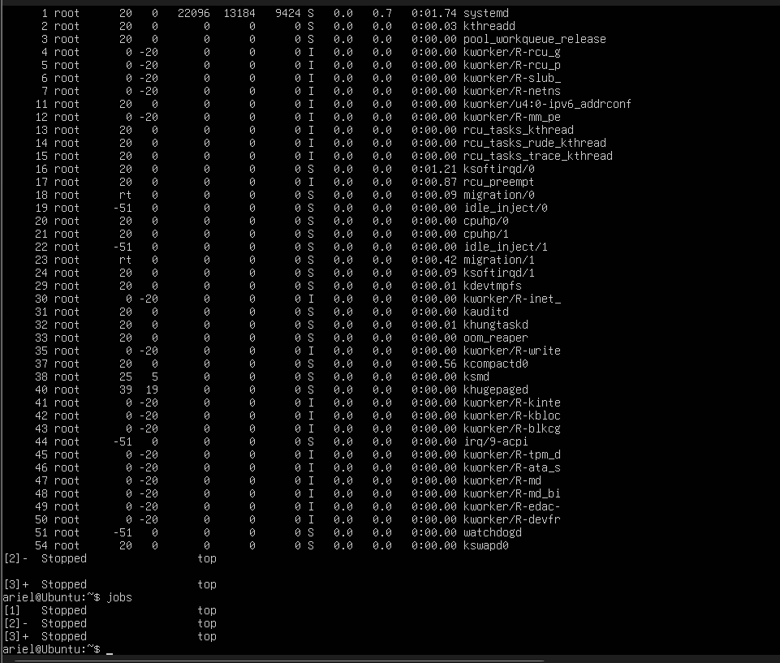 
top tidak berjalan dengan baik, Meskipun setelah perintah bg tampilan top masih terlihat di layar terminal, sebenarnya proses tersebut tidak berjalan dengan baik (mengalami freeze)
4. Kembalikan ke foreground dengan fg, lalu keluar dengan q .
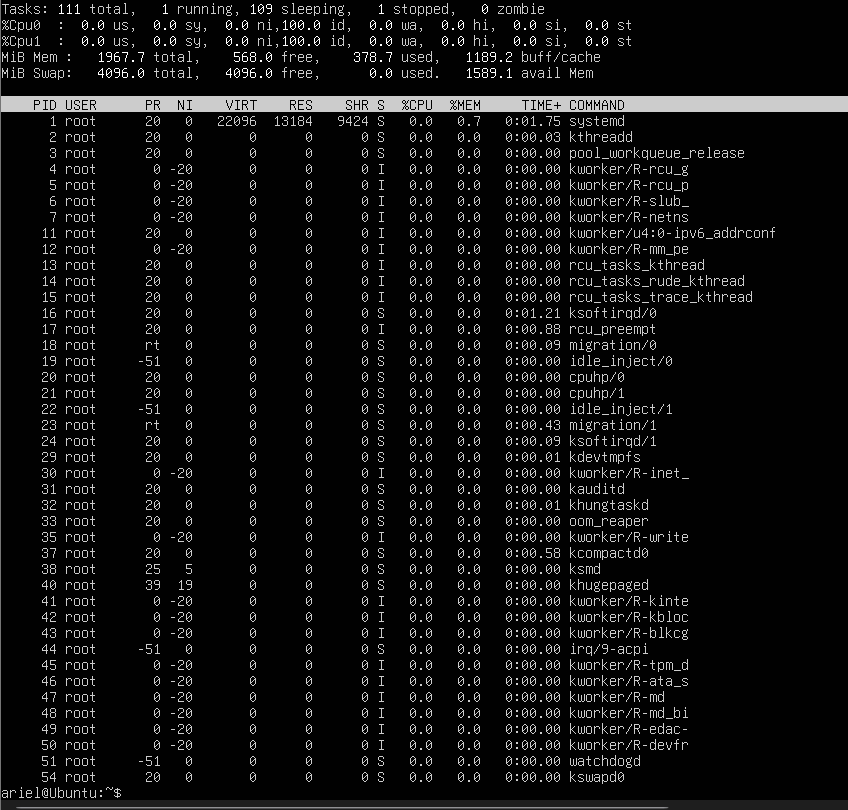  
## Latihan 6.6
1. Gunakan ps aux –sort=%mem untuk menemukan proses yang menggunakan memori paling banyak di VM Anda. Proses apa itu?
2. Di dalam top, tekan 1 . Apa yang berubah pada tampilan? Mengapa
informasi ini berguna?
3. Di dalam htop, navigasikan ke proses sshd menggunakan tombol panah.
Tekan F9 dan amati opsi sinyal yang tersedia.
